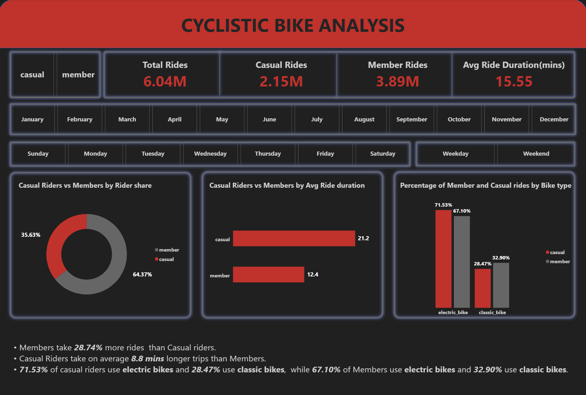
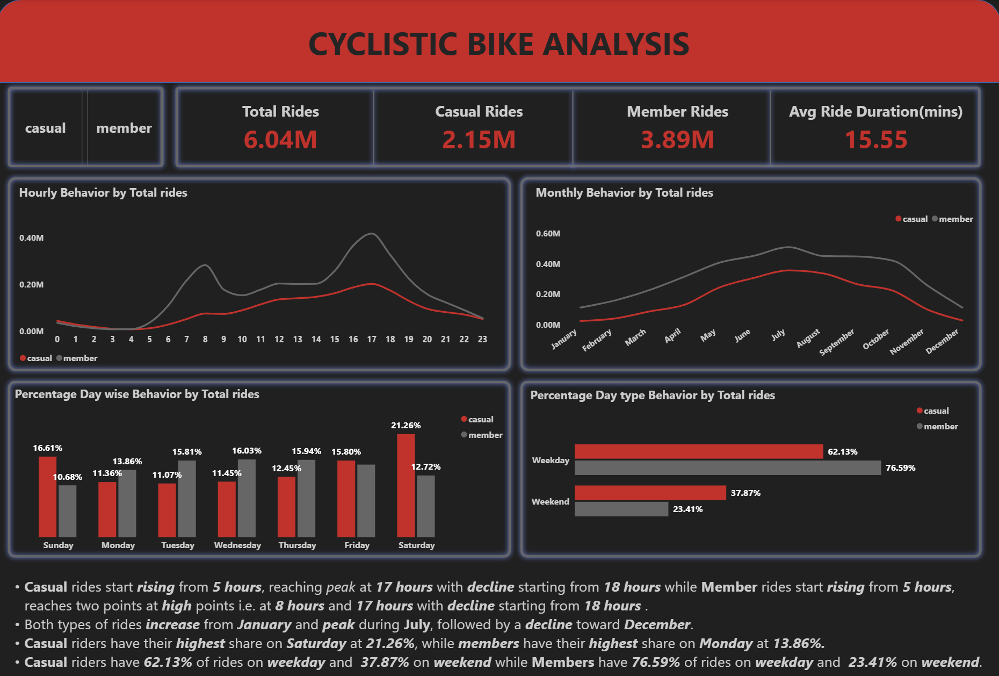
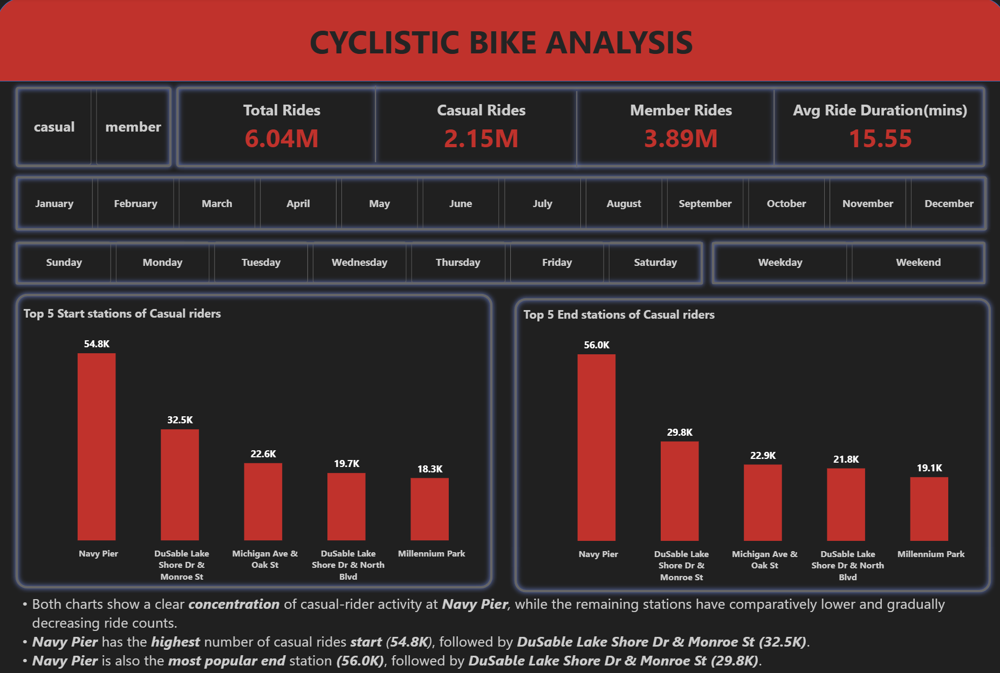

# Cyclistic Bike-Share Analysis

## 📌 Project Overview

This project analyzes Cyclistic bike-share usage to answer the business question:

> **How do annual members and casual riders use Cyclistic bikes differently?**

The goal is to identify behavioral differences between **casual riders** and **annual members** and use those insights to recommend marketing strategies that can help convert casual riders into annual members.

---

## 🎯 Business Objective

Cyclistic wants to maximize annual memberships. Instead of targeting completely new customers, the analysis focuses on **casual riders who already use Cyclistic** and identifies patterns that can support their conversion into annual members.

---

## 📸 Dashboard Preview





---

## 🛠️ Tools used

- **Python**
  - Pandas
  - NumPy
- **MySQL**
  - SQL aggregation
  - Window functions
  - Filtering and grouping
- **Power BI**
  - Interactive dashboards
  - DAX measures
  - Slicers
  - Data visualization
 
---

## 🔄 Project Workflow

```text
Raw Dataset
     ↓
Data Merging
     ↓
Data Cleaning & Feature Engineering
     ↓
SQL Business Analysis
     ↓
Visualization
     ↓
Findings
     ↓
Recommendations
```

---

## 📊 Key Insights

- Members account for **64.37%** of total rides, while casual riders account for **35.63%**.
- Casual riders have a higher average ride duration (**21.2 min**) than members (**12.4 min**).
- Casual riders have a higher **weekend ride share (37.87%)** compared with members (**23.41%**).
- Both rider types reach their highest monthly usage around **July**.
- **Navy Pier** is the most popular start and end station among casual riders.

---

## 💡 Recommendations

1. Cyclistic should do promotions during **July** and **August** on **Weekends** between **15 to 18 hours** because at this point of time Casual riders rides the most.
2. Cyclistic should run promotion campaigns at **Navy Pier** station as there is clear **concentration** of casual-rider activity at **Navy Pier**.
3. As Casual riders **ride long** than Members so Cyclistic should **emphasize** the **value** or **convenience** of membership for frequent longer trips.

---

## 🗂️ Project Files
| File | Description |
|---|---|
| `cyclistic_bike_analysis.ipynb` | Python notebook |
| `cyclistic_bike_analysis.sql` | SQL queries |
| `dashboard.pbix` | Interactive dashboard |
| `dashboard_image1.png` | Dashboard Page 1|
| `dashboard_image2.png` | Dashboard Page 2|
| `dashboard_image3.png` | Dashboard Page 3|
| `data_cleaning.word` | Data Cleaning Documentation|
| `business_objective_and_recommendations.word` | Business Objective and Recommendations|
| `presentation.ppt` | Presentation|

---

# 🎯 Skills Demonstrated

- Data Cleaning
- Exploratory Data Analysis
- Feature Engineering
- Python
- Pandas
- NumPy
- SQL
- MySQL
- Window Functions
- Data Aggregation
- Power BI
- DAX
- Data Visualization
- Dashboard Development
- Business Intelligence
- Business Recommendations
- Data Storytelling

---

## 🎯 Final Takeaway

Casual riders use Cyclistic differently from members: they take longer rides, have a higher weekend usage share, and are more concentrated around recreational locations. These behavioral differences provide clear opportunities for targeted membership-conversion campaigns.
